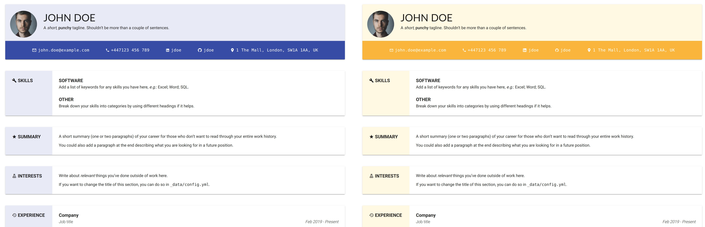
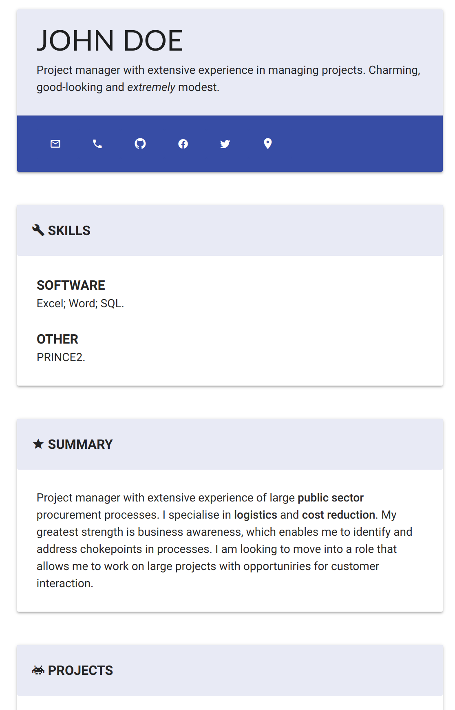
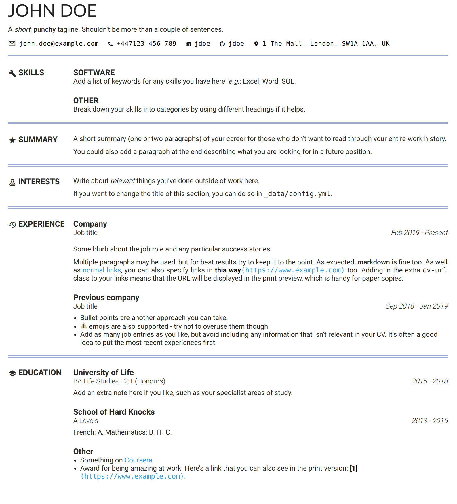

# Material CV

A CV/resume made with Jekyll and Material design. Suitable for desktop, mobile and
print.

## Features

* Customisable theme.
* Easily maintain your CV content with markdown files, without needing to worry about
  the layout.
* Responsive layout suitable for desktops/tablets/phones.
* Print preview will re-render the document in a format suitable for printing or saving
  to PDF.

## Getting started

Simply add your details as follows:

* Put your name and contact details in `_data/about.yml`.
* Write the contents of your CV in the `.md` files in `contents/`.
* (Optional) save a profile picture to `assets/images` to include in the document
  header.

> :warning: If you fork this project, then your fork will be **public** meaning anyone
> can see any personal details you commit to github. If you have personal details that
> you don't want to publish, then you should create a private copy of the repo instead.
> See [this page](https://gist.github.com/0xjac/85097472043b697ab57ba1b1c7530274) for
> guidance on how to do that.

Optionally, you can also configure the section order/names/icons and the colour scheme
in `_config.yml`. You can also add in an optional profile picture here (web layout
only).

View your CV locally by running the following commands in the project directory:

```
sudo gem install jekyll bundler
bundle update
bundle exec jekyll serve`
```

Then browse to `http://localhost:4000` to view your CV. Alternatively, push your content
to GitHub and view your page online at `https://<username>.github.io/<fork>` (make sure
you enable github pages on your fork first).

## Demo

See a live demo [here](https://big-o.github.io/materialcv).

The layout follows a simple card-based format on most desktops. The colour, section
headers etc. can easily be changed in `_config.yml`:



On smaller devices such as mobile, the cards take on a more vertical format to better
utilise space:



The print format is also optimised for PDF/paper. As well as having a more
paper-friendly layout, you can also ensure that URLs are displayed alongside any anchor
labels, so no information is lost:


